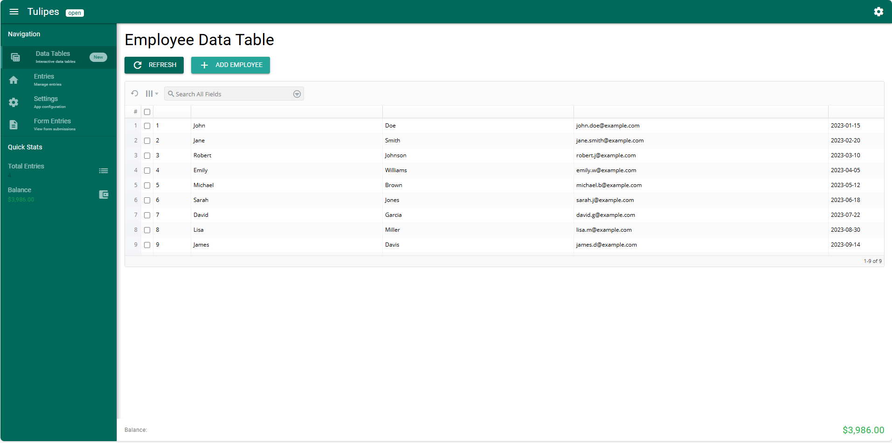
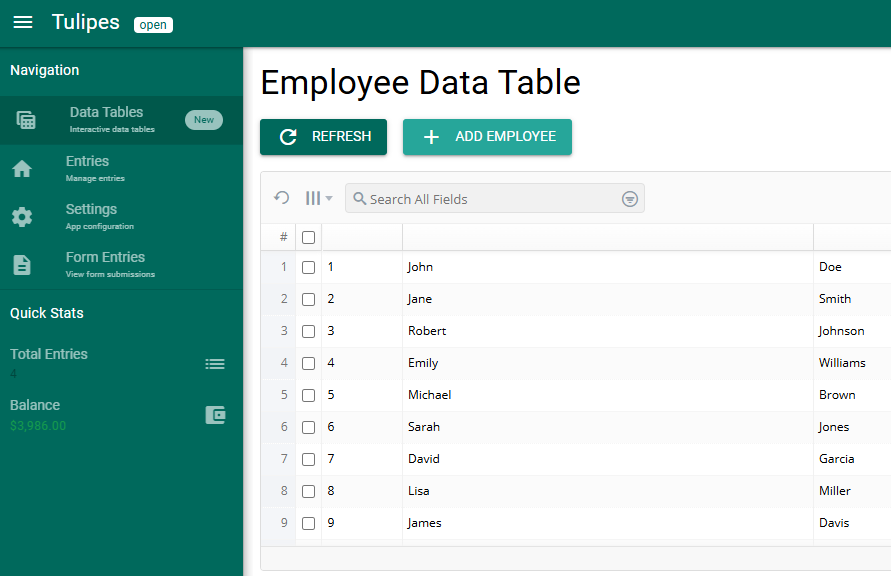

# Tulipes Money Tracker

A comprehensive money tracking application built with Vue 3, Quasar Framework, and w2ui data tables.

## Screenshots

| Data Table View | Form Entries View |
|-----------------|------------------|
|  |  |

## Features

- **🚀 Zero Installation** - 100% CDN-based, no `npm install` required!
- **📱 PWA Ready** - Installable as a native app with offline caching support
- **🎨 Dynamic SCSS** - Real-time SCSS compilation for live styling updates
- **📊 Data Management** - Advanced w2ui grid tables with sorting, searching, and filtering
- **📝 Form Handling** - Multi-step forms with validation and data persistence
- **📱 Mobile Responsive** - Optimized for both desktop and mobile devices
- **🎨 Modern UI** - Built with Quasar Framework for beautiful, responsive design
- **💾 Local Storage** - Data persistence using browser local storage
- **🔍 Search & Filter** - Powerful search capabilities across all data
- **📤 Export Functionality** - Export data to CSV format
- **⚡ Instant Loading** - All libraries loaded from reliable CDNs
- **🔄 Auto Caching** - PWA service worker caches all assets for offline use

## Technology Stack

- **Frontend**: Vue 3 + Quasar Framework (CDN)
- **Data Tables**: w2ui 2.x (CDN)
- **Routing**: Vue Router 4 (CDN)
- **Styling**: Quasar CSS + Dynamic SCSS Compiler
- **Icons**: Quasar Icons (CDN)
- **PWA**: Service Worker with Caching Strategy
- **Build Tool**: Zero-build - Pure CDN approach

## Quick Start - No Installation Required!

### Option 1: Direct Access
Simply open `index.html` in your browser or serve it with any web server.

### Option 2: Local Development
```bash
# Clone the repository
git clone https://github.com/touilfarouk/vite.git
cd vite

# Serve with any web server (Python example)
python -m http.server 8000
# OR use Node.js
npx serve .
# OR use PHP built-in server
php -S localhost:8000

# Open http://localhost:8000 in your browser
```

### Option 3: Install as PWA
1. Open the application in your browser
2. Click the "Install" button in the address bar
3. The app will be installed on your device like a native app

## 🌟 Why No npm install?

- **Instant Setup** - No dependency management or version conflicts
- **Always Latest** - CDNs serve the latest stable versions
- **Better Caching** - CDN edge caching for faster global loading
- **Simpler Deployment** - Just copy files to any web server
- **PWA Optimized** - Service worker handles all asset caching
- **Dynamic Styling** - SCSS compiled in real-time without build step

## PWA Features

- **Installable** - Add to home screen on mobile devices
- **Offline Support** - Works without internet connection
- **Background Sync** - Syncs data when connection is restored
- **Push Notifications** - Native notification support
- **App-like Experience** - Fullscreen, standalone application

## Project Structure

```
├── index.html           # Main application entry point
├── manifest.json        # PWA manifest file
├── sw.js               # Service worker for offline support
├── src/
│   ├── components/     # Reusable Vue components
│   ├── layouts/        # Application layouts
│   ├── pages/          # Page components
│   ├── router/         # Vue Router configuration
│   ├── css/            # Custom styles & SCSS
│   └── data/           # Sample data files
├── js/                 # Local scripts (store, etc.)
└── icons/              # PWA app icons
```

## Contributing

1. Fork the repository
2. Create your feature branch (`git checkout -b feature/AmazingFeature`)
3. Commit your changes (`git commit -m 'Add some AmazingFeature'`)
4. Push to the branch (`git push origin feature/AmazingFeature`)
5. Open a Pull Request

## License

This project is licensed under the MIT License - see the LICENSE file for details.
